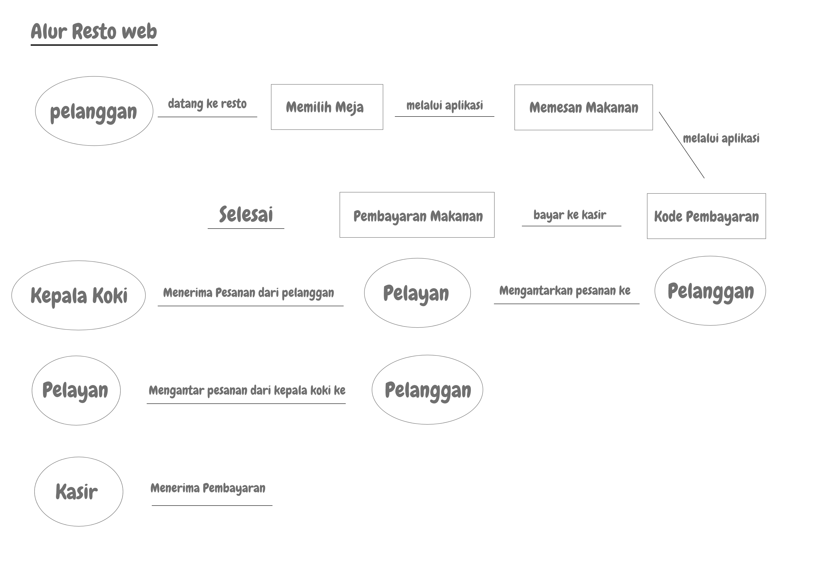
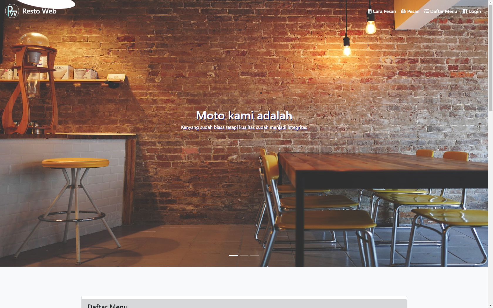
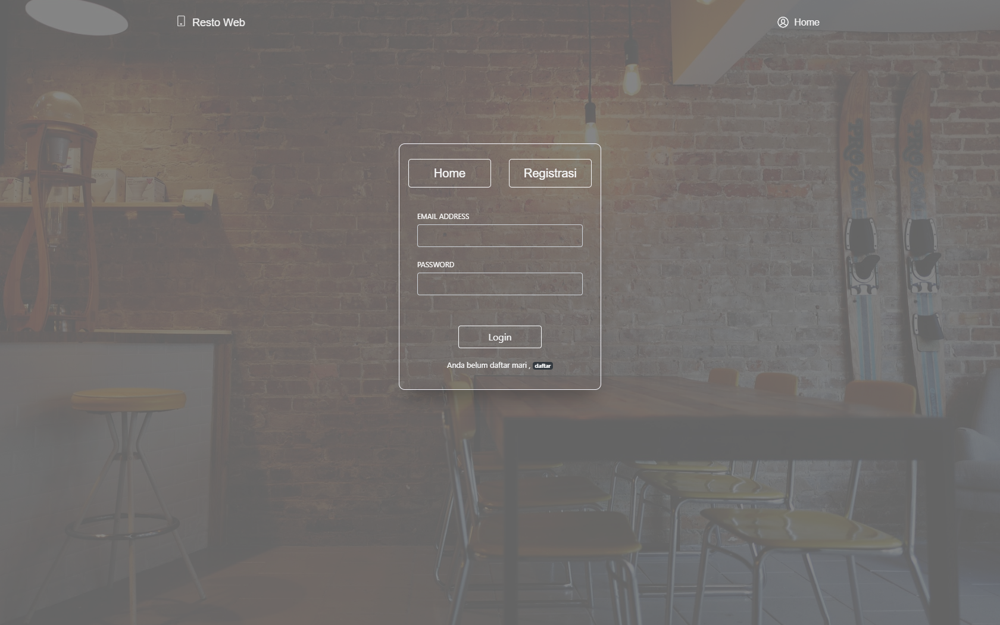
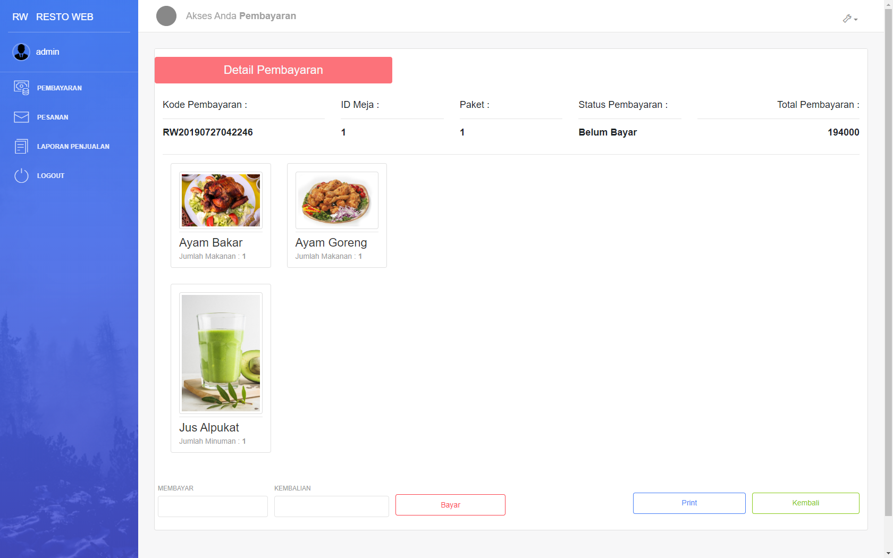

# Selamat Datang Di Aplikasi Resto Web

Aplikasi ini adalah sebuah aplikasi yang menerapkan sistem pemesanan Web yang hanya bisa diakses di tempat resto tersebut
jadi nantinya si konsumen akan memesan dengan cara memilih makanan dan minuman lalu memilih meja dimana tempat dia akan makan
di resto tersebut atau juga makanan ini bisa dibawa pulang tanpa memilih meja

Aplikasi ini dibuat menggunakan :
  1. PHP Codeigniter 3
  2. CSS Boostrap 3
  3. Template Light Boostrap
  4. Beberapa Plugin seperti js datepicker, fpdf untuk laporan, datatables boostrap dan lain lain

Aplikasi ini juga mempunyai 3 Hak akses: 
  1. Kasir
  2. Pelayan
  3. Kepala Koki

Gambaran dari alur aplikasi ini adalah : 

Gambaran dari aplikasi ini ialah dibawah ini

 

 

Aplikasi ini Masih dalam pengembangan dan masih belum bisa dipakai tetapi sudah muncul alur dan desainnya:
- Resto Web RW v.1 (sampai saat ini)
